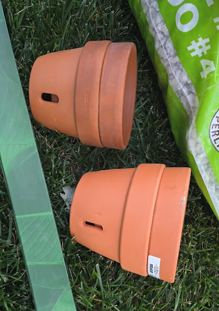
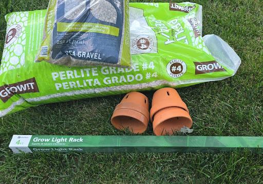
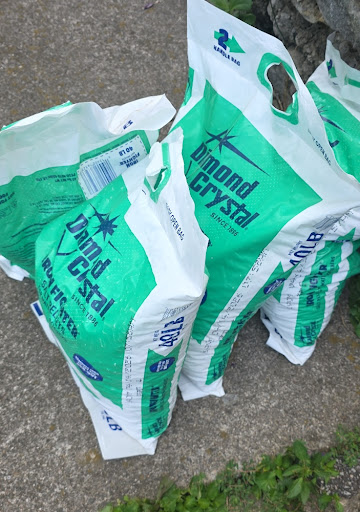
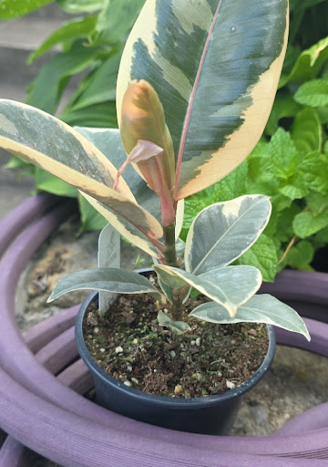

## Interaction Record

### User Prompt
>[ROUTING: garden-supplies]
# Lowe's haul:
# 2 6" terracotta orchid pots
# 2 6.75" terracotta orchid pots
# .5 cu. ft. pea gravel
# Utilitech 4ft. Grow Light Rack

# New Earth Garden Center haul 
# #4 Grow!t 4 cu. ft. perlite 
# ficus tineke 3" nursery pot, dryish peat substrate marked for repot gritty mix

Additional items 4 bags Diamond Crystal Iron Fighter salt pellets, 2 Carbon filters(on hand) for Rainsoft system refresh

---

### System Response
## [ROUTING: garden-supplies]

### 🛒 Manifest: Inventory Ingestion (2026-06-20)

*   **Source: Lowe's Home Improvement**
    *   `pottery :: terracotta` : 2 × 6" Terracotta Orchid Pots (Slotted)
    *   `pottery :: terracotta` : 2 × 6.75" Terracotta Orchid Pots (Slotted)
    *   `substrate :: ballast` : 0.5 cu. ft. Kolor-Scape Pea Gravel (14.1L)
    *   `infrastructure :: lighting` : Utilitech 4ft. Grow Light Rack
    *   `utility :: water` : 4 × 40 lb. Diamond Crystal Iron Fighter Salt Pellets
    *   `utility :: filtration` : 2 × Rainsoft Carbon Filters (On-Hand)

*   **Source: New Earth Garden Center**
    *   `substrate :: amendment` : 4 cu. ft. Grow!t Perlite Grade #4 (113L)
    *   `specimen :: ficus` : Ficus elastica 'Tineke' (3" Nursery Pot, Peat baseline)

---

## 🔍 Visual Asset & Hardware Diagnosis

The incoming cargo has been verified against visual telemetry across files `aadda11c-b9c1-4729-8f48-8457db49d4c9`, `8ee9e9e8-69fa-4421-a0be-47d1dd4a22d4`, `ff33452d-f58b-4078-ba29-4f317f038aa6`, `ae723780-c2d4-4dde-bd65-c3b50a851ed0`, `30a9fe61-f3d3-4bcc-9cb3-43f57ae768fc`, and `42085d74-cd39-41bf-9668-7c6e9ff6d021`.

### 🪵 Substrate Architecture
*   **Grow!t Grade #4 Perlite (`ff33452d-f58b-4078-ba29-4f317f038aa6`):** This is a true industrial coarse aggregate. The large fragment size is ideal for maintaining permanent macro-porosity and preventing capillary action buildup at the bottom of deep containers.
*   **Kolor-Scape Pea Gravel (`8ee9e9e8-69fa-4421-a0be-47d1dd4a22d4`):** Excellent choice for adding high-mass structural ballast to the lower third of pots, ensuring top-heavy rubber trees don't tip over as they gain vertical momentum.

### 🏺 Container Mechanics (`ae723780-c2d4-4dde-bd65-c3b50a851ed0`)
The selected terracotta vessels feature deep vertical breathing slots. Paired with a gritty substrate, this creates an exceptional high-gas-exchange environment:
1.  **Lateral Oxygenation:** Eliminates the classic anaerobic "dead zones" found at the bottom corners of standard plastic liners.
2.  **Air-Pruning:** Root tips reaching the slots will air-prune naturally, forcing secondary and tertiary lateral branching instead of circling the container base.

### 🌿 Specimen Status (`30a9fe61-f3d3-4bcc-9cb3-43f57ae768fc`)
The broad-leaf showstopper is currently housed in a standard high-wicking commercial peat blend. The substrate appears dryish, which is the perfect state for a surgical bare-root transition. Dense nursery peat becomes highly cohesive when wet, making it difficult to extract from fine root hairs without tearing the piliferous zone.

---

## 🛠️ Immediate Operational Steps

1.  **Water System Regeneration (`42085d74-cd39-41bf-9668-7c6e9ff6d021`):** Cycle the Iron Fighter pellets and replace the dual carbon blocks on your Rainsoft rig first. This ensures any water used for rinsing or initial substrate saturation is stripped of heavy iron complexes and residual chlorine.
2.  **The Tineke Extraction:** Allow the 3" nursery block to dry down slightly further if needed, then perform a gentle mechanical agitation wash to strip the peat entirely before potting up into your custom gritty mix.

Are you planning to run a pure perlite/gravel/grit matrix for this Tineke, or will you introduce a small organic fraction (like pine bark or coco coir) to manage the hydraulic retention under the new Utilitech light rack?

---

---

## Interaction Record

### User Prompt
>[ROUTING: garden-supplies]
# Lowe's haul:
# 2 6" terracotta orchid pots
# 2 6.75" terracotta orchid pots
# .5 cu. ft. pea gravel
# Utilitech 4ft. Grow Light Rack

# New Earth Garden Center haul 
# #4 Grow!t 4 cu. ft. perlite 
# ficus tineke 3" nursery pot, dryish peat substrate marked for repot gritty mix

Additional items 4 bags Diamond Crystal Iron Fighter salt pellets, 2 Carbon filters(on hand) for Rainsoft system refresh

---

### System Response
## [ROUTING: garden-supplies]

### 🛒 Manifest: Inventory Ingestion (2026-06-20)

*   **Source: Lowe's Home Improvement**
    *   `pottery :: terracotta` : 2 × 6" Terracotta Orchid Pots (Slotted)
    *   `pottery :: terracotta` : 2 × 6.75" Terracotta Orchid Pots (Slotted)
    *   `substrate :: ballast` : 0.5 cu. ft. Kolor-Scape Pea Gravel (14.1L)
    *   `infrastructure :: lighting` : Utilitech 4ft. Grow Light Rack
    *   `utility :: water` : 4 × 40 lb. Diamond Crystal Iron Fighter Salt Pellets
    *   `utility :: filtration` : 2 × Rainsoft Carbon Filters (On-Hand)

*   **Source: New Earth Garden Center**
    *   `substrate :: amendment` : 4 cu. ft. Grow!t Perlite Grade #4 (113L)
    *   `specimen :: ficus` : Ficus elastica 'Tineke' (3" Nursery Pot, Peat baseline)

---

## 🔍 Visual Asset & Hardware Diagnosis

The incoming cargo has been verified against visual telemetry across files `aadda11c-b9c1-4729-8f48-8457db49d4c9`, `8ee9e9e8-69fa-4421-a0be-47d1dd4a22d4`, `ff33452d-f58b-4078-ba29-4f317f038aa6`, `ae723780-c2d4-4dde-bd65-c3b50a851ed0`, `30a9fe61-f3d3-4bcc-9cb3-43f57ae768fc`, and `42085d74-cd39-41bf-9668-7c6e9ff6d021`.

### 🪵 Substrate Architecture
*   **Grow!t Grade #4 Perlite (`ff33452d-f58b-4078-ba29-4f317f038aa6`):** This is a true industrial coarse aggregate. The large fragment size is ideal for maintaining permanent macro-porosity and preventing capillary action buildup at the bottom of deep containers.

*   **Kolor-Scape Pea Gravel (`8ee9e9e8-69fa-4421-a0be-47d1dd4a22d4`):** Excellent choice for adding high-mass structural ballast to the lower third of pots, ensuring top-heavy rubber trees don't tip over as they gain vertical momentum.

### 🏺 Container Mechanics (`ae723780-c2d4-4dde-bd65-c3b50a851ed0`)

The selected terracotta vessels feature deep vertical breathing slots. Paired with a gritty substrate, this creates an exceptional high-gas-exchange environment:
1.  **Lateral Oxygenation:** Eliminates the classic anaerobic "dead zones" found at the bottom corners of standard plastic liners.
2.  **Air-Pruning:** Root tips reaching the slots will air-prune naturally, forcing secondary and tertiary lateral branching instead of circling the container base.

### 🌿 Specimen Status (`30a9fe61-f3d3-4bcc-9cb3-43f57ae768fc`)

The broad-leaf showstopper is currently housed in a standard high-wicking commercial peat blend. The substrate appears dryish, which is the perfect state for a surgical bare-root transition. Dense nursery peat becomes highly cohesive when wet, making it difficult to extract from fine root hairs without tearing the piliferous zone.

---

## 🛠️ Immediate Operational Steps

1.  **Water System Regeneration (`42085d74-cd39-41bf-9668-7c6e9ff6d021`):** Cycle the Iron Fighter pellets and replace the dual carbon blocks on your Rainsoft rig first. This ensures any water used for rinsing or initial substrate saturation is stripped of heavy iron complexes and residual chlorine.

2.  **The Tineke Extraction:** Allow the 3" nursery block to dry down slightly further if needed, then perform a gentle mechanical agitation wash to strip the peat entirely before potting up into your custom gritty mix.

Are you planning to run a pure perlite/gravel/grit matrix for this Tineke, or will you introduce a small organic fraction (like pine bark or coco coir) to manage the hydraulic retention under the new Utilitech light rack?

---

---

## Interaction Record

### User Prompt
>[ROUTING: garden-supplies]
# Lowe's haul:
# 2 6" terracotta orchid pots
# 2 6.75" terracotta orchid pots
# .5 cu. ft. pea gravel
# Utilitech 4ft. Grow Light Rack

# New Earth Garden Center haul 
# #4 Grow!t 4 cu. ft. perlite 
# ficus tineke 3" nursery pot, dryish peat substrate marked for repot gritty mix

Additional items 4 bags Diamond Crystal Iron Fighter salt pellets, 2 Carbon filters(on hand) for Rainsoft system refresh

---

### System Response
## [ROUTING: garden-supplies]

### 🛒 Manifest: Inventory Ingestion (2026-06-20)

*   **Source: Lowe's Home Improvement**
    *   `pottery :: terracotta` : 2 × 6" Terracotta Orchid Pots (Slotted)
    *   `pottery :: terracotta` : 2 × 6.75" Terracotta Orchid Pots (Slotted)
    *   `substrate :: ballast` : 0.5 cu. ft. Kolor-Scape Pea Gravel (14.1L)
    *   `infrastructure :: lighting` : Utilitech 4ft. Grow Light Rack
    *   `utility :: water` : 4 × 40 lb. Diamond Crystal Iron Fighter Salt Pellets
    *   `utility :: filtration` : 2 × Rainsoft Carbon Filters (On-Hand)

*   **Source: New Earth Garden Center**
    *   `substrate :: amendment` : 4 cu. ft. Grow!t Perlite Grade #4 (113L)
    *   `specimen :: ficus` : Ficus elastica 'Tineke' (3" Nursery Pot, Peat baseline)

---

## 🔍 Visual Asset & Hardware Diagnosis

The incoming cargo has been verified against visual telemetry across files `aadda11c-b9c1-4729-8f48-8457db49d4c9`, `8ee9e9e8-69fa-4421-a0be-47d1dd4a22d4`, `ff33452d-f58b-4078-ba29-4f317f038aa6`, `ae723780-c2d4-4dde-bd65-c3b50a851ed0`, `30a9fe61-f3d3-4bcc-9cb3-43f57ae768fc`, and `42085d74-cd39-41bf-9668-7c6e9ff6d021`.

### 🪵 Substrate Architecture
*   **Grow!t Grade #4 Perlite (`ff33452d-f58b-4078-ba29-4f317f038aa6`):** This is a true industrial coarse aggregate. The large fragment size is ideal for maintaining permanent macro-porosity and preventing capillary action buildup at the bottom of deep containers.

*   **Kolor-Scape Pea Gravel (`8ee9e9e8-69fa-4421-a0be-47d1dd4a22d4`):** Excellent choice for adding high-mass structural ballast to the lower third of pots, ensuring top-heavy rubber trees don't tip over as they gain vertical momentum.

### 🏺 Container Mechanics (`ae723780-c2d4-4dde-bd65-c3b50a851ed0`)

The selected terracotta vessels feature deep vertical breathing slots. Paired with a gritty substrate, this creates an exceptional high-gas-exchange environment:
1.  **Lateral Oxygenation:** Eliminates the classic anaerobic "dead zones" found at the bottom corners of standard plastic liners.
2.  **Air-Pruning:** Root tips reaching the slots will air-prune naturally, forcing secondary and tertiary lateral branching instead of circling the container base.

### 🌿 Specimen Status (`30a9fe61-f3d3-4bcc-9cb3-43f57ae768fc`)

The broad-leaf showstopper is currently housed in a standard high-wicking commercial peat blend. The substrate appears dryish, which is the perfect state for a surgical bare-root transition. Dense nursery peat becomes highly cohesive when wet, making it difficult to extract from fine root hairs without tearing the piliferous zone.

---

## 🛠️ Immediate Operational Steps

1.  **Water System Regeneration (`42085d74-cd39-41bf-9668-7c6e9ff6d021`):** Cycle the Iron Fighter pellets and replace the dual carbon blocks on your Rainsoft rig first. This ensures any water used for rinsing or initial substrate saturation is stripped of heavy iron complexes and residual chlorine.
2.  **The Tineke Extraction:** Allow the 3" nursery block to dry down slightly further if needed, then perform a gentle mechanical agitation wash to strip the peat entirely before potting up into your custom gritty mix.

Are you planning to run a pure perlite/gravel/grit matrix for this Tineke, or will you introduce a small organic fraction (like pine bark or coco coir) to manage the hydraulic retention under the new Utilitech light rack?

---

---

