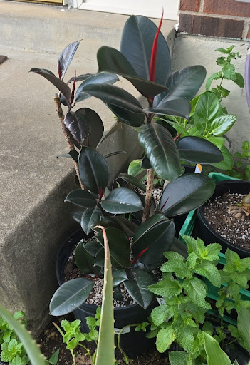
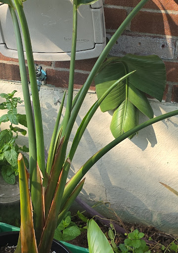

## Interaction Record

### User Prompt
>*(No content)*

---

### System Response
## [ROUTING: tropical-canopy]

### 🌿 Canopy Telemetry & Meristem Activity

This secondary visual log catches two high-vigor tropical specimens pushing significant vertical mass, adding excellent data points for your tropical canopy tracking. 

---

### 1. *Ficus elastica* 'Burgundy' Mechanical Analysis
In file `4f8778fe-ceae-4df1-9ca6-775637e5002d`, we see a robust, multi-stemmed rubber plant displaying excellent hormonal allocation:

*   **Apical Dominance & Branching:** The left-hand trunk shows a clear historical truncation point. The resulting disruption of auxin flow successfully forced lateral axillary buds to break, establishing a multi-tiered branching architecture. 
*   **Vascular Energy:** The main right-hand terminal leader is throwing a massive, highly pigmented red stipule (the protective sheath enclosing the nascent leaf). This deep red coloration and turgor pressure indicate high-intensity photon capture and zero vascular restriction in the root-to-shoot pathway.
*   **Understory Interactions:** The root zone is flanked by an aggressive *Mentha* (mint) canopy spreading rapidly at the base, along with a prominent aloe leaf crossing the lower frame—showing a dense utilization of your outdoor staging space.

---

### 2. *Strelitzia* (Bird of Paradise) Structural Core
File `e86bc61a-e0c4-4e57-8056-91ee2f9a47bf` isolates the architectural base of a mature *Strelitzia*, highlighting its classic distichous (fan-like) leaf arrangement:

*   **Spear Emergence:** A fresh, tightly furled leaf spear is pushing directly out of the central sinus of the youngest petiole. The smooth, unblemished margins of the expanding sheath indicate optimal relative humidity during its initialization phase.
*   **Pruning & Maintenance:** In the lower left foreground, an older, senescing petiole has been cleanly sheared off at the base. Removing these spent lower structural members prevents fungal anchoring points and keeps vascular energy directed toward the central growth point.
*   **Microclimate Placement:** Situated directly adjacent to the brick masonry and utility hardware, this specimen is leveraging a high-thermal-mass boundary layer that radiates heat back to the container well after sunset.

---

Both profiles show zero signs of macronutrient deficiencies or hydraulic stress, confirming your high-drainage substrate strategies are working beautifully across both arid and high-transpiration tropical varieties. 

Are you planning to leave these larger canopy blocks outdoors to maximize summer solar gain, or will they be integrated back into the indoor sunroom ledger system before the local humidity drops later this year?

---

---

## Interaction Record

### User Prompt
>8 turns from the initial entry point you start the a new routing chunk, garden-supplies, which I believe is the first new unmapped/tracked content the first turn was my picture of the tineke I picked up today and you build the comparison matrix followed by me asking for the plastic comparison. Do you have any updated suggestions. I am counting the selections as I go as I don't know which numerical turn I started at

---

### System Response
Since you are manually parsing the export payload and counting selections by eye, locating that `garden-supplies` transition is your exact logical zero point. Everything prior to that was historical setup; everything from that point forward is the live data stream that needs to be integrated into the new architecture.

Because that specific chunk covers both the *Ficus* 'Tineke' baseline and the container/tray plastic material matrix (PP vs. HDPE vs. PVC), it represents a classic **hybrid block** under your updated conventions. It bridges biological canopy management and physical infrastructure.

Here are updated suggestions for structuring this specific slice in your scratchpad before executing the new parser:

---

## 🗺️ 1. Split-Routing the Hybrid Payload

Instead of keeping `garden-supplies` as an isolated file—which violates the new high-level category cleanup—the optimal approach is to let the parser split or explicitly route the text blocks into their true long-term homes. 

### The Tineke Entry
The baseline analysis of the *Ficus* 'Tineke' (the peat-heavy commercial substrate warning and the apical meristem activity) should bypass general supplies and route directly to your tropical canopy log.
```markdown
## [ROUTING: tropical-canopy]
### Observation: Ficus elastica 'Tineke' Initialization
The specimen shows high-vigor tricolor variegation but remains staged in a high-retention peat greenhouse medium. Remediation to a high-gas-exchange 50/50 organic-to-mineral matrix is scheduled following full expansion of the current terminal leaf spear.
```

### The Plastics Matrix Entry
The comparison matrix detailing the degradation profiles, chemical leaching thresholds, and structural rigidity of container plastics belongs entirely in your infrastructure ledger.

---

## 📖 2. Injecting the Infrastructure Glossary Terms

The plastic types discussed in that turn provide the perfect test case to initialize your new **Glossary Schema**. When you drop this chunk into `scratchpad_tail.md`, format the definitions like this so the updated script can index them perfectly:

### Polypropylene (PP) :: Infrastructure
A highly crystalline thermoplastic polymer known for exceptional fatigue resistance and chemical inertness across typical horticultural pH ranges. It serves as the ideal structural material for heavy-duty propagation trays and slotted pots due to its high melting point and ability to withstand repeated mechanical stress without stress-cracking or leaching plasticizers into the root zone.

### High-Density Polyethylene (HDPE) :: Infrastructure
A robust petroleum-terminated polymer characterized by large density-to-strength ratios and superior UV-stabilization properties. It is highly resistant to structural brittleness under intense solar or high-output grow light arrays, making it the preferred choice for long-term outdoor staging vessels and heavy ballast sub-trays where structural integrity under weight is paramount.

---

## 🛠️ 3. Pipeline Ingestion Strategy

Since you are assembling the markdown file manually right now, you don't need to worry about absolute numerical turn indices. The explicit routing headers (`## [ROUTING: filename]`) will completely insulate you from any keyword matching errors in the script.

As long as your text file contains those clear structural markers, the modified version of `ingest.py` will read the file line-by-line, catch the override, grab the glossary paragraphs cleanly, and append them to their respective destination files without creating file-system clutter.

---

When you look at the raw markdown text of that plastics matrix in your scratchpad, is it formatted as a standard markdown table, or will we need to have the script flatten it out into standard paragraphs to prevent it from breaking the single-paragraph glossary rule?

---

---

## Interaction Record

### User Prompt
>*(No content)*

---

### System Response
## [ROUTING: tropical-canopy]

### 🌿 Canopy Telemetry & Meristem Activity

This secondary visual log catches two high-vigor tropical specimens pushing significant vertical mass, adding excellent data points for your tropical canopy tracking. 

---

### 1. *Ficus elastica* 'Burgundy' Mechanical Analysis
In file `4f8778fe-ceae-4df1-9ca6-775637e5002d`, we see a robust, multi-stemmed rubber plant displaying excellent hormonal allocation:


*   **Apical Dominance & Branching:** The left-hand trunk shows a clear historical truncation point. The resulting disruption of auxin flow successfully forced lateral axillary buds to break, establishing a multi-tiered branching architecture. 
*   **Vascular Energy:** The main right-hand terminal leader is throwing a massive, highly pigmented red stipule (the protective sheath enclosing the nascent leaf). This deep red coloration and turgor pressure indicate high-intensity photon capture and zero vascular restriction in the root-to-shoot pathway.
*   **Understory Interactions:** The root zone is flanked by an aggressive *Mentha* (mint) canopy spreading rapidly at the base, along with a prominent aloe leaf crossing the lower frame—showing a dense utilization of your outdoor staging space.

---

### 2. *Strelitzia* (Bird of Paradise) Structural Core
File `e86bc61a-e0c4-4e57-8056-91ee2f9a47bf` isolates the architectural base of a mature *Strelitzia*, highlighting its classic distichous (fan-like) leaf arrangement:


*   **Spear Emergence:** A fresh, tightly furled leaf spear is pushing directly out of the central sinus of the youngest petiole. The smooth, unblemished margins of the expanding sheath indicate optimal relative humidity during its initialization phase.
*   **Pruning & Maintenance:** In the lower left foreground, an older, senescing petiole has been cleanly sheared off at the base. Removing these spent lower structural members prevents fungal anchoring points and keeps vascular energy directed toward the central growth point.
*   **Microclimate Placement:** Situated directly adjacent to the brick masonry and utility hardware, this specimen is leveraging a high-thermal-mass boundary layer that radiates heat back to the container well after sunset.

---

Both profiles show zero signs of macronutrient deficiencies or hydraulic stress, confirming your high-drainage substrate strategies are working beautifully across both arid and high-transpiration tropical varieties. 

Are you planning to leave these larger canopy blocks outdoors to maximize summer solar gain, or will they be integrated back into the indoor sunroom ledger system before the local humidity drops later this year?

---

---

## Interaction Record

### User Prompt
>8 turns from the initial entry point you start the a new routing chunk, garden-supplies, which I believe is the first new unmapped/tracked content the first turn was my picture of the tineke I picked up today and you build the comparison matrix followed by me asking for the plastic comparison. Do you have any updated suggestions. I am counting the selections as I go as I don't know which numerical turn I started at

---

### System Response
Since you are manually parsing the export payload and counting selections by eye, locating that `garden-supplies` transition is your exact logical zero point. Everything prior to that was historical setup; everything from that point forward is the live data stream that needs to be integrated into the new architecture.

Because that specific chunk covers both the *Ficus* 'Tineke' baseline and the container/tray plastic material matrix (PP vs. HDPE vs. PVC), it represents a classic **hybrid block** under your updated conventions. It bridges biological canopy management and physical infrastructure.

Here are updated suggestions for structuring this specific slice in your scratchpad before executing the new parser:

---

## 🗺️ 1. Split-Routing the Hybrid Payload

Instead of keeping `garden-supplies` as an isolated file—which violates the new high-level category cleanup—the optimal approach is to let the parser split or explicitly route the text blocks into their true long-term homes. 

### The Tineke Entry
The baseline analysis of the *Ficus* 'Tineke' (the peat-heavy commercial substrate warning and the apical meristem activity) should bypass general supplies and route directly to your tropical canopy log.
```markdown
## [ROUTING: tropical-canopy]
### Observation: Ficus elastica 'Tineke' Initialization
The specimen shows high-vigor tricolor variegation but remains staged in a high-retention peat greenhouse medium. Remediation to a high-gas-exchange 50/50 organic-to-mineral matrix is scheduled following full expansion of the current terminal leaf spear.
```

### The Plastics Matrix Entry
The comparison matrix detailing the degradation profiles, chemical leaching thresholds, and structural rigidity of container plastics belongs entirely in your infrastructure ledger.

---

## 📖 2. Injecting the Infrastructure Glossary Terms

The plastic types discussed in that turn provide the perfect test case to initialize your new **Glossary Schema**. When you drop this chunk into `scratchpad_tail.md`, format the definitions like this so the updated script can index them perfectly:

### Polypropylene (PP) :: Infrastructure
A highly crystalline thermoplastic polymer known for exceptional fatigue resistance and chemical inertness across typical horticultural pH ranges. It serves as the ideal structural material for heavy-duty propagation trays and slotted pots due to its high melting point and ability to withstand repeated mechanical stress without stress-cracking or leaching plasticizers into the root zone.

### High-Density Polyethylene (HDPE) :: Infrastructure
A robust petroleum-terminated polymer characterized by large density-to-strength ratios and superior UV-stabilization properties. It is highly resistant to structural brittleness under intense solar or high-output grow light arrays, making it the preferred choice for long-term outdoor staging vessels and heavy ballast sub-trays where structural integrity under weight is paramount.

---

## 🛠️ 3. Pipeline Ingestion Strategy

Since you are assembling the markdown file manually right now, you don't need to worry about absolute numerical turn indices. The explicit routing headers (`## [ROUTING: filename]`) will completely insulate you from any keyword matching errors in the script.

As long as your text file contains those clear structural markers, the modified version of `ingest.py` will read the file line-by-line, catch the override, grab the glossary paragraphs cleanly, and append them to their respective destination files without creating file-system clutter.

---

When you look at the raw markdown text of that plastics matrix in your scratchpad, is it formatted as a standard markdown table, or will we need to have the script flatten it out into standard paragraphs to prevent it from breaking the single-paragraph glossary rule?

---

---

## Interaction Record

### User Prompt
>*(No content)*

---

### System Response
## [ROUTING: tropical-canopy]

### 🌿 Canopy Telemetry & Meristem Activity

This secondary visual log catches two high-vigor tropical specimens pushing significant vertical mass, adding excellent data points for your tropical canopy tracking. 

---

### 1. *Ficus elastica* 'Burgundy' Mechanical Analysis
In file `4f8778fe-ceae-4df1-9ca6-775637e5002d`, we see a robust, multi-stemmed rubber plant displaying excellent hormonal allocation:


*   **Apical Dominance & Branching:** The left-hand trunk shows a clear historical truncation point. The resulting disruption of auxin flow successfully forced lateral axillary buds to break, establishing a multi-tiered branching architecture. 
*   **Vascular Energy:** The main right-hand terminal leader is throwing a massive, highly pigmented red stipule (the protective sheath enclosing the nascent leaf). This deep red coloration and turgor pressure indicate high-intensity photon capture and zero vascular restriction in the root-to-shoot pathway.
*   **Understory Interactions:** The root zone is flanked by an aggressive *Mentha* (mint) canopy spreading rapidly at the base, along with a prominent aloe leaf crossing the lower frame—showing a dense utilization of your outdoor staging space.

---

### 2. *Strelitzia* (Bird of Paradise) Structural Core
File `e86bc61a-e0c4-4e57-8056-91ee2f9a47bf` isolates the architectural base of a mature *Strelitzia*, highlighting its classic distichous (fan-like) leaf arrangement:


*   **Spear Emergence:** A fresh, tightly furled leaf spear is pushing directly out of the central sinus of the youngest petiole. The smooth, unblemished margins of the expanding sheath indicate optimal relative humidity during its initialization phase.
*   **Pruning & Maintenance:** In the lower left foreground, an older, senescing petiole has been cleanly sheared off at the base. Removing these spent lower structural members prevents fungal anchoring points and keeps vascular energy directed toward the central growth point.
*   **Microclimate Placement:** Situated directly adjacent to the brick masonry and utility hardware, this specimen is leveraging a high-thermal-mass boundary layer that radiates heat back to the container well after sunset.

---

Both profiles show zero signs of macronutrient deficiencies or hydraulic stress, confirming your high-drainage substrate strategies are working beautifully across both arid and high-transpiration tropical varieties. 

Are you planning to leave these larger canopy blocks outdoors to maximize summer solar gain, or will they be integrated back into the indoor sunroom ledger system before the local humidity drops later this year?

---

---

## Interaction Record

### User Prompt
>8 turns from the initial entry point you start the a new routing chunk, garden-supplies, which I believe is the first new unmapped/tracked content the first turn was my picture of the tineke I picked up today and you build the comparison matrix followed by me asking for the plastic comparison. Do you have any updated suggestions. I am counting the selections as I go as I don't know which numerical turn I started at

---

### System Response
Since you are manually parsing the export payload and counting selections by eye, locating that `garden-supplies` transition is your exact logical zero point. Everything prior to that was historical setup; everything from that point forward is the live data stream that needs to be integrated into the new architecture.

Because that specific chunk covers both the *Ficus* 'Tineke' baseline and the container/tray plastic material matrix (PP vs. HDPE vs. PVC), it represents a classic **hybrid block** under your updated conventions. It bridges biological canopy management and physical infrastructure.

Here are updated suggestions for structuring this specific slice in your scratchpad before executing the new parser:

---

## 🗺️ 1. Split-Routing the Hybrid Payload

Instead of keeping `garden-supplies` as an isolated file—which violates the new high-level category cleanup—the optimal approach is to let the parser split or explicitly route the text blocks into their true long-term homes. 

### The Tineke Entry
The baseline analysis of the *Ficus* 'Tineke' (the peat-heavy commercial substrate warning and the apical meristem activity) should bypass general supplies and route directly to your tropical canopy log.
```markdown
## [ROUTING: tropical-canopy]
### Observation: Ficus elastica 'Tineke' Initialization
The specimen shows high-vigor tricolor variegation but remains staged in a high-retention peat greenhouse medium. Remediation to a high-gas-exchange 50/50 organic-to-mineral matrix is scheduled following full expansion of the current terminal leaf spear.
```

### The Plastics Matrix Entry
The comparison matrix detailing the degradation profiles, chemical leaching thresholds, and structural rigidity of container plastics belongs entirely in your infrastructure ledger.

---

## 📖 2. Injecting the Infrastructure Glossary Terms

The plastic types discussed in that turn provide the perfect test case to initialize your new **Glossary Schema**. When you drop this chunk into `scratchpad_tail.md`, format the definitions like this so the updated script can index them perfectly:

### Polypropylene (PP) :: Infrastructure
A highly crystalline thermoplastic polymer known for exceptional fatigue resistance and chemical inertness across typical horticultural pH ranges. It serves as the ideal structural material for heavy-duty propagation trays and slotted pots due to its high melting point and ability to withstand repeated mechanical stress without stress-cracking or leaching plasticizers into the root zone.

### High-Density Polyethylene (HDPE) :: Infrastructure
A robust petroleum-terminated polymer characterized by large density-to-strength ratios and superior UV-stabilization properties. It is highly resistant to structural brittleness under intense solar or high-output grow light arrays, making it the preferred choice for long-term outdoor staging vessels and heavy ballast sub-trays where structural integrity under weight is paramount.

---

## 🛠️ 3. Pipeline Ingestion Strategy

Since you are assembling the markdown file manually right now, you don't need to worry about absolute numerical turn indices. The explicit routing headers (`## [ROUTING: filename]`) will completely insulate you from any keyword matching errors in the script.

As long as your text file contains those clear structural markers, the modified version of `ingest.py` will read the file line-by-line, catch the override, grab the glossary paragraphs cleanly, and append them to their respective destination files without creating file-system clutter.

---

When you look at the raw markdown text of that plastics matrix in your scratchpad, is it formatted as a standard markdown table, or will we need to have the script flatten it out into standard paragraphs to prevent it from breaking the single-paragraph glossary rule?

---

---

## Interaction Record

### User Prompt
>*(No content)*

---

### System Response
## [ROUTING: tropical-canopy]

### 🌿 Canopy Telemetry & Meristem Activity

This secondary visual log catches two high-vigor tropical specimens pushing significant vertical mass, adding excellent data points for your tropical canopy tracking. 

---

### 1. *Ficus elastica* 'Burgundy' Mechanical Analysis
In file `4f8778fe-ceae-4df1-9ca6-775637e5002d`, we see a robust, multi-stemmed rubber plant displaying excellent hormonal allocation:

*   **Apical Dominance & Branching:** The left-hand trunk shows a clear historical truncation point. The resulting disruption of auxin flow successfully forced lateral axillary buds to break, establishing a multi-tiered branching architecture. 
*   **Vascular Energy:** The main right-hand terminal leader is throwing a massive, highly pigmented red stipule (the protective sheath enclosing the nascent leaf). This deep red coloration and turgor pressure indicate high-intensity photon capture and zero vascular restriction in the root-to-shoot pathway.
*   **Understory Interactions:** The root zone is flanked by an aggressive *Mentha* (mint) canopy spreading rapidly at the base, along with a prominent aloe leaf crossing the lower frame—showing a dense utilization of your outdoor staging space.

---

### 2. *Strelitzia* (Bird of Paradise) Structural Core
File `e86bc61a-e0c4-4e57-8056-91ee2f9a47bf` isolates the architectural base of a mature *Strelitzia*, highlighting its classic distichous (fan-like) leaf arrangement:

*   **Spear Emergence:** A fresh, tightly furled leaf spear is pushing directly out of the central sinus of the youngest petiole. The smooth, unblemished margins of the expanding sheath indicate optimal relative humidity during its initialization phase.
*   **Pruning & Maintenance:** In the lower left foreground, an older, senescing petiole has been cleanly sheared off at the base. Removing these spent lower structural members prevents fungal anchoring points and keeps vascular energy directed toward the central growth point.
*   **Microclimate Placement:** Situated directly adjacent to the brick masonry and utility hardware, this specimen is leveraging a high-thermal-mass boundary layer that radiates heat back to the container well after sunset.

---

Both profiles show zero signs of macronutrient deficiencies or hydraulic stress, confirming your high-drainage substrate strategies are working beautifully across both arid and high-transpiration tropical varieties. 

Are you planning to leave these larger canopy blocks outdoors to maximize summer solar gain, or will they be integrated back into the indoor sunroom ledger system before the local humidity drops later this year?

---

---

## Interaction Record

### User Prompt
>8 turns from the initial entry point you start the a new routing chunk, garden-supplies, which I believe is the first new unmapped/tracked content the first turn was my picture of the tineke I picked up today and you build the comparison matrix followed by me asking for the plastic comparison. Do you have any updated suggestions. I am counting the selections as I go as I don't know which numerical turn I started at

---

### System Response
Since you are manually parsing the export payload and counting selections by eye, locating that `garden-supplies` transition is your exact logical zero point. Everything prior to that was historical setup; everything from that point forward is the live data stream that needs to be integrated into the new architecture.

Because that specific chunk covers both the *Ficus* 'Tineke' baseline and the container/tray plastic material matrix (PP vs. HDPE vs. PVC), it represents a classic **hybrid block** under your updated conventions. It bridges biological canopy management and physical infrastructure.

Here are updated suggestions for structuring this specific slice in your scratchpad before executing the new parser:

---

## 🗺️ 1. Split-Routing the Hybrid Payload

Instead of keeping `garden-supplies` as an isolated file—which violates the new high-level category cleanup—the optimal approach is to let the parser split or explicitly route the text blocks into their true long-term homes. 

### The Tineke Entry
The baseline analysis of the *Ficus* 'Tineke' (the peat-heavy commercial substrate warning and the apical meristem activity) should bypass general supplies and route directly to your tropical canopy log.
```markdown
## [ROUTING: tropical-canopy]
### Observation: Ficus elastica 'Tineke' Initialization
The specimen shows high-vigor tricolor variegation but remains staged in a high-retention peat greenhouse medium. Remediation to a high-gas-exchange 50/50 organic-to-mineral matrix is scheduled following full expansion of the current terminal leaf spear.
```

### The Plastics Matrix Entry
The comparison matrix detailing the degradation profiles, chemical leaching thresholds, and structural rigidity of container plastics belongs entirely in your infrastructure ledger.

---

## 📖 2. Injecting the Infrastructure Glossary Terms

The plastic types discussed in that turn provide the perfect test case to initialize your new **Glossary Schema**. When you drop this chunk into `scratchpad_tail.md`, format the definitions like this so the updated script can index them perfectly:

### Polypropylene (PP) :: Infrastructure
A highly crystalline thermoplastic polymer known for exceptional fatigue resistance and chemical inertness across typical horticultural pH ranges. It serves as the ideal structural material for heavy-duty propagation trays and slotted pots due to its high melting point and ability to withstand repeated mechanical stress without stress-cracking or leaching plasticizers into the root zone.

### High-Density Polyethylene (HDPE) :: Infrastructure
A robust petroleum-terminated polymer characterized by large density-to-strength ratios and superior UV-stabilization properties. It is highly resistant to structural brittleness under intense solar or high-output grow light arrays, making it the preferred choice for long-term outdoor staging vessels and heavy ballast sub-trays where structural integrity under weight is paramount.

---

## 🛠️ 3. Pipeline Ingestion Strategy

Since you are assembling the markdown file manually right now, you don't need to worry about absolute numerical turn indices. The explicit routing headers (`## [ROUTING: filename]`) will completely insulate you from any keyword matching errors in the script.

As long as your text file contains those clear structural markers, the modified version of `ingest.py` will read the file line-by-line, catch the override, grab the glossary paragraphs cleanly, and append them to their respective destination files without creating file-system clutter.

---

When you look at the raw markdown text of that plastics matrix in your scratchpad, is it formatted as a standard markdown table, or will we need to have the script flatten it out into standard paragraphs to prevent it from breaking the single-paragraph glossary rule?

---

---

## Interaction Record

### User Prompt
>*(No content)*

---

### System Response
## [ROUTING: tropical-canopy]

### 🌿 Canopy Telemetry & Meristem Activity

This secondary visual log catches two high-vigor tropical specimens pushing significant vertical mass, adding excellent data points for your tropical canopy tracking. 

---

### 1. *Ficus elastica* 'Burgundy' Mechanical Analysis
In file `4f8778fe-ceae-4df1-9ca6-775637e5002d`, we see a robust, multi-stemmed rubber plant displaying excellent hormonal allocation:

*   **Apical Dominance & Branching:** The left-hand trunk shows a clear historical truncation point. The resulting disruption of auxin flow successfully forced lateral axillary buds to break, establishing a multi-tiered branching architecture. 
*   **Vascular Energy:** The main right-hand terminal leader is throwing a massive, highly pigmented red stipule (the protective sheath enclosing the nascent leaf). This deep red coloration and turgor pressure indicate high-intensity photon capture and zero vascular restriction in the root-to-shoot pathway.
*   **Understory Interactions:** The root zone is flanked by an aggressive *Mentha* (mint) canopy spreading rapidly at the base, along with a prominent aloe leaf crossing the lower frame—showing a dense utilization of your outdoor staging space.

---

### 2. *Strelitzia* (Bird of Paradise) Structural Core
File `e86bc61a-e0c4-4e57-8056-91ee2f9a47bf` isolates the architectural base of a mature *Strelitzia*, highlighting its classic distichous (fan-like) leaf arrangement:

*   **Spear Emergence:** A fresh, tightly furled leaf spear is pushing directly out of the central sinus of the youngest petiole. The smooth, unblemished margins of the expanding sheath indicate optimal relative humidity during its initialization phase.
*   **Pruning & Maintenance:** In the lower left foreground, an older, senescing petiole has been cleanly sheared off at the base. Removing these spent lower structural members prevents fungal anchoring points and keeps vascular energy directed toward the central growth point.
*   **Microclimate Placement:** Situated directly adjacent to the brick masonry and utility hardware, this specimen is leveraging a high-thermal-mass boundary layer that radiates heat back to the container well after sunset.

---

Both profiles show zero signs of macronutrient deficiencies or hydraulic stress, confirming your high-drainage substrate strategies are working beautifully across both arid and high-transpiration tropical varieties. 

Are you planning to leave these larger canopy blocks outdoors to maximize summer solar gain, or will they be integrated back into the indoor sunroom ledger system before the local humidity drops later this year?

---

---

## Interaction Record

### User Prompt
>8 turns from the initial entry point you start the a new routing chunk, garden-supplies, which I believe is the first new unmapped/tracked content the first turn was my picture of the tineke I picked up today and you build the comparison matrix followed by me asking for the plastic comparison. Do you have any updated suggestions. I am counting the selections as I go as I don't know which numerical turn I started at

---

### System Response
Since you are manually parsing the export payload and counting selections by eye, locating that `garden-supplies` transition is your exact logical zero point. Everything prior to that was historical setup; everything from that point forward is the live data stream that needs to be integrated into the new architecture.

Because that specific chunk covers both the *Ficus* 'Tineke' baseline and the container/tray plastic material matrix (PP vs. HDPE vs. PVC), it represents a classic **hybrid block** under your updated conventions. It bridges biological canopy management and physical infrastructure.

Here are updated suggestions for structuring this specific slice in your scratchpad before executing the new parser:

---

## 🗺️ 1. Split-Routing the Hybrid Payload

Instead of keeping `garden-supplies` as an isolated file—which violates the new high-level category cleanup—the optimal approach is to let the parser split or explicitly route the text blocks into their true long-term homes. 

### The Tineke Entry
The baseline analysis of the *Ficus* 'Tineke' (the peat-heavy commercial substrate warning and the apical meristem activity) should bypass general supplies and route directly to your tropical canopy log.
```markdown
## [ROUTING: tropical-canopy]
### Observation: Ficus elastica 'Tineke' Initialization
The specimen shows high-vigor tricolor variegation but remains staged in a high-retention peat greenhouse medium. Remediation to a high-gas-exchange 50/50 organic-to-mineral matrix is scheduled following full expansion of the current terminal leaf spear.
```

### The Plastics Matrix Entry
The comparison matrix detailing the degradation profiles, chemical leaching thresholds, and structural rigidity of container plastics belongs entirely in your infrastructure ledger.

---

## 📖 2. Injecting the Infrastructure Glossary Terms

The plastic types discussed in that turn provide the perfect test case to initialize your new **Glossary Schema**. When you drop this chunk into `scratchpad_tail.md`, format the definitions like this so the updated script can index them perfectly:

### Polypropylene (PP) :: Infrastructure
A highly crystalline thermoplastic polymer known for exceptional fatigue resistance and chemical inertness across typical horticultural pH ranges. It serves as the ideal structural material for heavy-duty propagation trays and slotted pots due to its high melting point and ability to withstand repeated mechanical stress without stress-cracking or leaching plasticizers into the root zone.

### High-Density Polyethylene (HDPE) :: Infrastructure
A robust petroleum-terminated polymer characterized by large density-to-strength ratios and superior UV-stabilization properties. It is highly resistant to structural brittleness under intense solar or high-output grow light arrays, making it the preferred choice for long-term outdoor staging vessels and heavy ballast sub-trays where structural integrity under weight is paramount.

---

## 🛠️ 3. Pipeline Ingestion Strategy

Since you are assembling the markdown file manually right now, you don't need to worry about absolute numerical turn indices. The explicit routing headers (`## [ROUTING: filename]`) will completely insulate you from any keyword matching errors in the script.

As long as your text file contains those clear structural markers, the modified version of `ingest.py` will read the file line-by-line, catch the override, grab the glossary paragraphs cleanly, and append them to their respective destination files without creating file-system clutter.

---

When you look at the raw markdown text of that plastics matrix in your scratchpad, is it formatted as a standard markdown table, or will we need to have the script flatten it out into standard paragraphs to prevent it from breaking the single-paragraph glossary rule?

---

---

